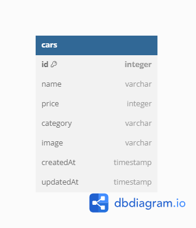

# Binar Academy Challenge Chapter 4

## _Car Management Dashboard_

repository untuk menyelesaikan challenge chapter 4


#### Features

> -   Read car data
> -   Create car data
> -   Update car data
> -   Delete car data
> -   Search by name
> -   Filter by category

###### Please follow the steps below carefully in order to run this project successfully.

#### 1. Download this project in zip format then extract and open it on your code editor or just git clone.

```shell
git clone https://github.com/Dimas-Mukhtar/CH4-challenge-car-management-dashboard.git
```

```shell
cd CH4-challenge-car-management-dashboard
```

#### 2. Install all the package and sequelize-cli globally.

```shell
npm install
```

```shell
npm install -g sequelize-cli
```

#### 3. Create .env file in the root directory, The file should have the same attribute as the .env.example file and customize the value according to your configuration.

```shell
PORT=3000
DB_USERNAME=YourDatabaseUsername
DB_PASSWORD=YourDatabasePassword
DB_NAME=YourDatabaseName
DB_HOST=YourDatabaseHost

PUBLIC_KEY=YourPublicKey
PRIVATE_KEY=YourPrivateKey
URL_ENDPOINT=YourUrlEndpoint
```

#### 4. Create your database for this project.

```shell
sequelize db:create
```

#### 5. Migration, to create a database table.

```shell
sequelize db:migrate
```

#### 6. The project setup is complete, let's run the project.

```shell
node server.js
```

#### 7. Open in your browser.

```shell
http://localhost:3000/admin
```

### I hope you have a great time checking out!

## API endpoint response


##### fetch all cars ~ GET: /api/v1/cars

```shell
{
    "status": "Success, cars fetched",
    "data": {
        "cars": [
            {
                "id": 39,
                "name": "sdfsdfs",
                "price": 322,
                "category": "Large",
                "image": "image_image-1681830687629.jpg",
                "createdAt": "2023-10-06T08:23:54.202Z",
                "updatedAt": "2023-10-06T08:23:54.202Z"
            }
        ]
    }
}
```

##### fetch car by id ~ GET: /api/v1/cars/45

```shell
{
    "status": "Success, car fetched where id 45",
    "data": {
        "car": {
            "id": 45,
            "name": "dsfsdfs",
            "price": 232,
            "category": "Large",
            "image": "image_image-1681481622654.jpg",
            "createdAt": "2023-10-06T08:25:47.696Z",
            "updatedAt": "2023-10-06T08:25:47.696Z"
        }
    }
}
```

##### create car ~ POST: /api/v1/cars

###### req.body

```shell
{
    "name": "Bukan lambhorgini",
    "price": 1000000,
    "category": "Large",
    "image": "lamborghini.png"
}

```

```shell
{
    "status": "Success, car created",
    "data": {
        "car": {
            "id": 47,
            "name": "Lamborghini",
            "price": 1000000,
            "category": "Large",
            "image": "lamborghini.png",
            "updatedAt": "2023-10-06T11:43:40.204Z",
            "createdAt": "2023-10-06T11:43:40.204Z"
        }
    }
}
```

##### edite car ~ PUT: /api/v1/cars/47

```shell
{
    "status": "Success, car updated where id 47",
    "data": {
        "car": [
            1
        ]
    }
}
```

##### delete car ~ DELETE: /api/v1/cars/47

```shell
{
    "status": "Success, car deleted where id 47",
    "data": {
        "car": 1
    }
}
```

## Entity Relationship Diagram


